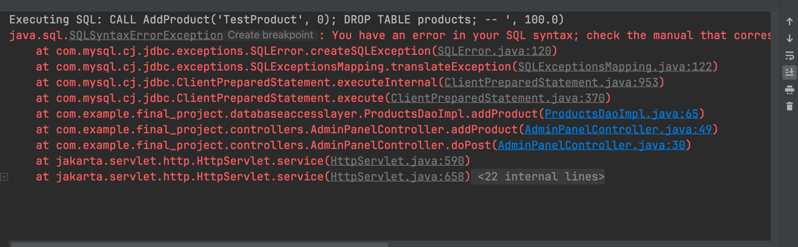
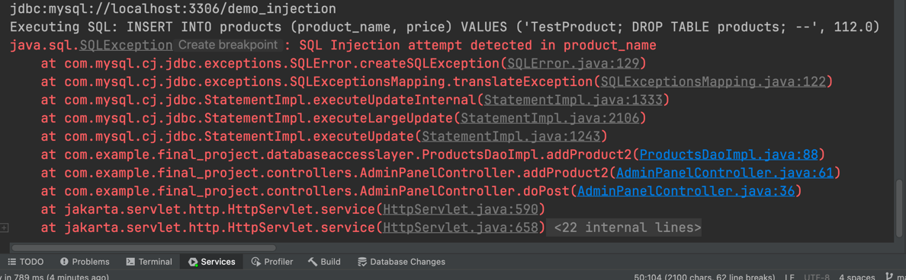

# sql injection prevention
### Setting up tutorial
1. Install IntelliJ (this project is developed using IntelliJ).
2. Download Tomcat 10.x from the official website.
3. Open the project with IntelliJ and configure the server as shown in the image below:
   1) Add Tomcat 10.x to the application server.
   2)	Add mysql-connector-j-8.0.33.jar
   3)	Copy mysql-connector-j-8.0.33.jar  to /tomcat/apache-tomcat-10.1.26/lib


4. Run src/main/resources/schema.sql to create tables and insert data.
5. Copy database.properties.cfg to database.properties in the same resources folder and configure your own database information.
6. Configure Tomcat


7. Run the project


Normal Login Entry (Prevents SQL Injection):
http://localhost:8080/final_project_war/login

Dummy Login Entry (Allows SQL Injection):
http://localhost:8080/final_project_war/login2

Example Input (Note: There’s a space after --):

email:
' OR '1'='1' -- 

password:
any 

## Using a procedure to prevent SQL injection
### create a product procedure
```sql
DROP PROCEDURE IF EXISTS AddProduct;
CREATE PROCEDURE AddProduct(
    IN p_product_name VARCHAR(50),
    IN p_price DOUBLE
)
BEGIN
    -- Insert a new product into the products table
    INSERT INTO products(product_name, price)
    VALUES (p_product_name, p_price);
END $$
```
Log in as an admin and navigate to the following page: 
http://localhost:8080/final_project_war/add_product

Input the following values to test SQL injection:

Product Name: TestProduct', 0); DROP TABLE products; --

Product Price: 200

Observe the outcome. You will see that the procedure effectively prevents the SQL injection attempt, as demonstrated below.


## Using a triggers to prevent SQL injection
### create a product trigger
```sql
DROP TRIGGER IF EXISTS prevent_sql_injection_products;
CREATE TRIGGER prevent_sql_injection_products
    BEFORE INSERT ON products
    FOR EACH ROW
BEGIN
    -- Check for suspicious characters or keywords in product_name
    IF NEW.product_name REGEXP '.*(--)|(;)|(\')|(\")|(\bOR\b)|(\bAND\b)|(\bSELECT\b)|(\bDROP\b).*' THEN
        SIGNAL SQLSTATE '45000'
            SET MESSAGE_TEXT = 'SQL Injection attempt detected in product_name';
    END IF;

    -- Optional: Additional validation for product_price
    -- Check for excessively large or negative prices
    IF NEW.price < 0 THEN
        SIGNAL SQLSTATE '45000'
            SET MESSAGE_TEXT = 'Invalid price: must be a positive number';
    END IF;

END $$
```
Log in as an admin and navigate to the following page:
http://localhost:8080/final_project_war/add_product2
Input the following values to test SQL injection:

Product Name: TestProduct; DROP TABLE products; --

Product Price: 200

Observe the outcome. You will see that the trigger effectively prevents the SQL injection attempt, as demonstrated below.
