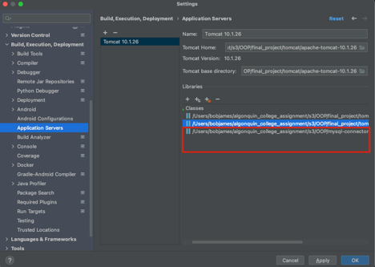
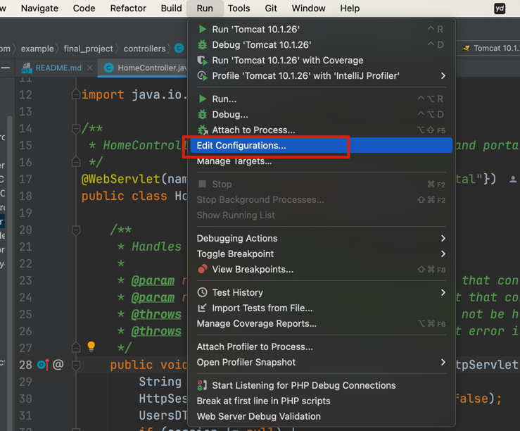
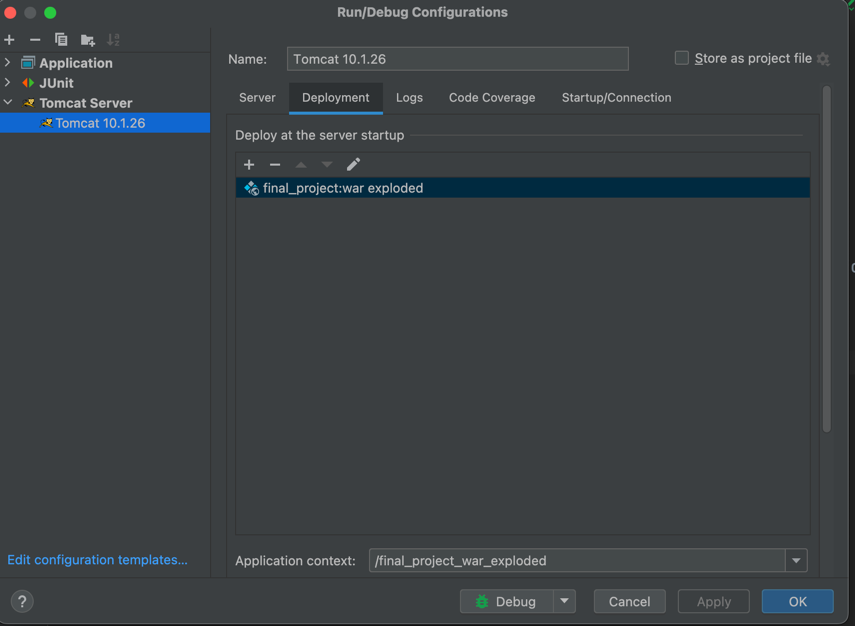
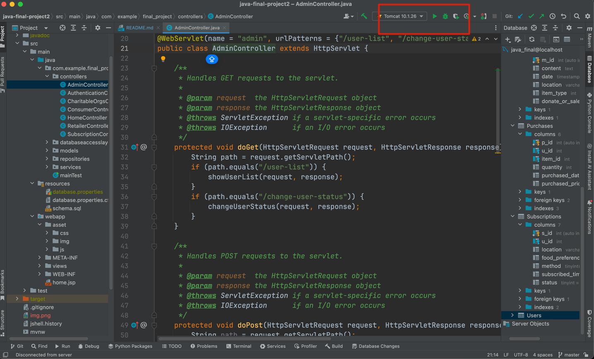

# sql injection prevention
### Setting up tutorial
1. Install IntelliJ (this project is developed using IntelliJ).
2. Download Tomcat 10.x from the official website.
3. Open the project with IntelliJ and configure the server as shown in the image below:
   1) Add Tomcat 10.x to the application server.
   2)	Add mysql-connector-j-8.0.33.jar
   3)	Copy mysql-connector-j-8.0.33.jar  to /tomcat/apache-tomcat-10.1.26/lib

4. Run src/main/resources/schema.sql to create tables and insert data.
5. Copy database.properties.cfg to database.properties in the same resources folder and configure your own database information.
6. Configure Tomcat

7. Run the project
